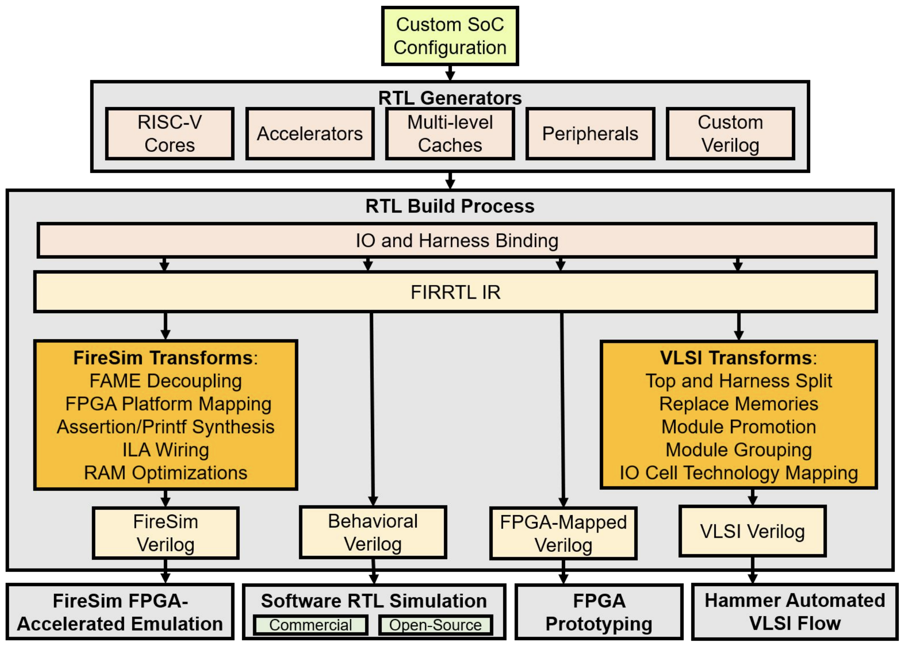

# Chipyard 

## Tutorial & Lab

BWRC & FPGA Bringup Platform Edition

## Overview



In this lab, we will explore the [Chipyard](https://github.com/ucb-bar/chipyard) framework. 
Chipyard is an integrated design, simulation, and implementation framework for open source hardware development developed here at UC Berkeley. 
Chipyard is open-sourced online and is based on the Chisel and FIRRTL hardware description libraries, as well as the Rocket Chip SoC generation ecosystem.
Chipyard brings together much of the work on hardware design methodology from Berkeley over the last decade as well as useful tools into a single repository that guarantees version compatibility between the projects it submodules.

A designer can use Chipyard to build, test, and tapeout (manufacture) a RISC-V-based SoC.
This includes RTL development integrated with Rocket Chip, cloud FPGA-accelerated simulation with FireSim, and physical design with the Hammer framework.
Information about Chisel can be found in [https://www.chisel-lang.org/](https://www.chisel-lang.org/).
While you will not be required to write any Chisel code in this lab, basic familiarity with the language will be helpful in understanding many of the components in the system and how they are put together.

<!-- An initial introduction to Chisel can be found in the Chisel bootcamp:  [https://github.com/freechipsproject/chisel-bootcamp](https://github.com/freechipsproject/chisel-bootcamp).  -->
<!-- Detailed documentation of Chisel functions can be found in [https://www.chisel-lang.org/api/SNAPSHOT/index.html](https://www.chisel-lang.org/api/SNAPSHOT/index.html). -->

Throughout the rest of the course, we will be developing our SoC using Chipyard as the base framework. 
There is a lot in Chipyard so we will only be able to explore a part of it in this lab, but hopefully you will get a brief sense of its capabilities.
We will simulate a Rocket Chip-based design at the RTL level, and then synthesize and place-and-route it in Intel 22nm technology using the Hammer back-end flow.


## Access & Setup

It should be clear by now this isn't going like most other courses. Most don't require signing non-disclosure agreements, or setting up a long string of IT infrastructure. Such is chip-design life. Running the Intel22 ChipYard lab will require access to a handful of BWRC research resources, including:

* Command-line access to the BWRC Linux servers
* The BWRC-Repo GitLab instance at [https://bwrcrepo.eecs.berkeley.edu](https://bwrcrepo.eecs.berkeley.edu)

If you don't have access to any of these, this isn't going to work yet. As of this lab's writing most student setup is in progress; if yours doesn't work yet, take a minute to bug your peers about whether theirs does, and perhaps bug your instructors or admins for good measure. 

This lab also presumes much of its GitLab interaction will occur via SSH. While setting up git to use HTTPS instead is possible by editing several lab materials, we recommend instead setting up [SSH keys](https://bwrcrepo.eecs.berkeley.edu/profile/keys) on the BWRC-Repo GitLab instance. 

## Getting Started

First, we will need to setup our Chipyard workspace.  
All of our work will occur on the BWRC compute cluster. 
For this lab, please work in the `/tools/C/` directory on the machine. 
This lab will likely generate too much data for it to fit in your home directory. 
All required materials are stored in the [BWRC-Repo GitLab instance](https://bwrcrepo.eecs.berkeley.edu).


First source the following environment file. This will add pre-compiled binaries of all the RISC-V tools to your PATH.

```
source /tools/C/ee290/env-riscv-tools.sh
```


Run the commands below. These commands clone the Chipyard repository, then initialize all the submodules.

```
mkdir -p /tools/C/userName/bringup
cd /tools/C/userName/bringup
git clone <PATH TO CHIPYARD> chipyard
cd chipyard
./scripts/init-submodules-no-riscv-tools.sh
```


You may have noticed while initializing your Chipyard repo that there are many submodules.  
Chipyard is built to allow the designer to generate complex configurations from different projects 
including the in-order Rocket Chip core, the out-of-order BOOM core, the systolic array Gemmini, and many other components needed to build a chip.
Thankfully, Chipyard has some great documentation, which can be found 
[here](https://chipyard.readthedocs.io/en/latest/).
You can find most of these in the `chipyard/generators/` directory.
All of these modules are built as generators (a core driving point of using Chisel), which means that each piece is parameterized and can be fit together with some of the functionality in Rocket Chip (check out the TileLink and Diplomacy references in the Chipyard documentation).
You can find the Chipyard specific code and its configs in `chipyard/generators/chipyard/src/main/scala/config`.
You can look at examples of how your own Chisel modules or verilog black-box modules can be integrated into a Rocket Chip-based SoC in `chipyard/generators/chipyard/src/main/scala/example`.
Many times, an accelerator block is connected to the Rocket core with a memory-mapped interface over the system bus. 
This allows the core to configure and read from the block.
Again, there is far too much to discuss fully here, but you can really put together a system very quickly using the infrastructure of Chipyard.


## FPGA Bitstream Generation


## Linux Image Generation


## Conclusion

Chipyard is designed to allow you to rapidly build and integrate your design with general purpose control and compute as well as a whole host of other generators.
You can then take your design, run some RTL simulations, and then push it through the VLSI flow with the technology of your choice using Hammer.
The tools integrated with Chipyard, from how you actually build your design (eg. Chisel and generators), to how you verify and benchmark its performance, to how you physically implement it, are meant to enable higher design QoR within an agile hardware design process through increased designer productivity and faster design iteration.
We just scratched the surface in this lab, but there are always more interesting features being integrated into Chipyard.
We recommend that you continue to explore what you can build with Chipyard given this introduction!

## Acknowledgements

Thank you to the whole Chipyard dev team for figures and documentation on Chipyard, to Daniel Grubb for authorship of the original tutorial on which this lab is based, and to Jerry Zhao and Dan Fritchman for updating the lab.

